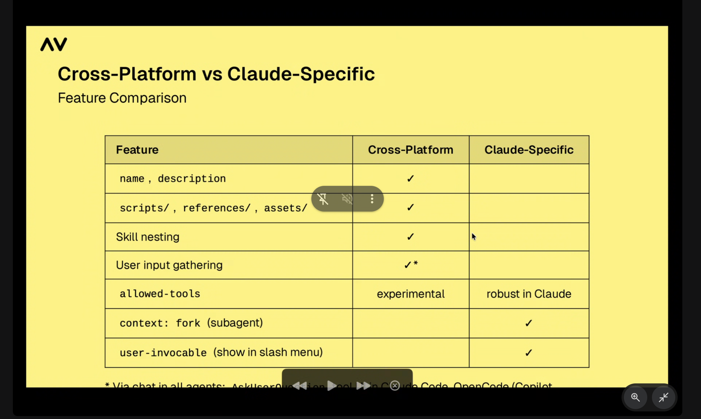

# Skills workshop

- Use slack for notes!

## Structure

- Short lecture
- Two live demos
- Hands on practice

- 20 minute break between each lesson

---

## The agentic platform

- 3 essential components:
  - Agentic model: LLM with reasoning, instruction following, tool use
  - Execution environment: Local computer, cloud VM, or container
  - Context and specialization: Provided by **skills**!


  - Without all 3 you dont have a full agent platform. A model alone is a chatbot, a model with execution but no skills is capable but generic. **Skills close the loop!**

---

## The click moment
- WHy skills exist

---
Onboarding a colleague:
- Building a skill is like writing an onboarding guide
- ai shifts from a tool you prompt to a colleague you onboard
- you do not need to be a programmer
- Requires a bit of systems thinking

---


## What are agent skills?

- Portable folders of expertise.

- Portable folders containing instructions, scripts, resources
- Skills let you inject domain knowledge
- a skill is a folder containing at a min a SKILL.md file
- Open standard: agentskills.io
---

## Cross platform portability

- Adopted by claude code, copilot, codex, opencode, antigravity
- Write once, run anywhere
- forward compatible: just text files
- Skills can completement MCP: MCP provides access, skill teachs how to use it.

---

## Agentic models

- Claude Opus 4.5
- gpt 5.2
- gemini 3
- GLM 4.7 (Zhipu AI)
- Minimax m-2.1 (minimax)

Models provide raw intelligence, skills provide specialized knowledge

---

## Why skills matter

- Composable, resuable, sharable, extensible
- Skills are sufficient for many workflows
- AI stack analogy
  - Models = processers
  - Agents = operating systems
  - Skills = applications
- Focus on building skills, not agents!

---
## Cateogizing skills

- information | industry guides / research notes | team procedures 
- behavior | writing standards/ communication style / report formats
- workflows | Apporoval processes/ personal routines/ publication steps
- tools | image gen / personal automations / batch processing 
---

## Progressive disclosure

- Structure like a manual: tabel of contents, chapters, appendex
- Load only what is needed, when it is needed
- Enables **hundreds of skills** without bloaring context

---

## Three levels of loading

1. name + description / 50-100 tokens
2. Full SKILL.md / keep under 500 lines / 5000 tokens
3. Reference, scripts, assets / loaded as needed (skills cost tokens)

---

## Choosing your agent platform

- Claude code!
- VScode with copilot
- codex, opencode, antigravity
- claude web, cowork
- any agent at agentskills.io
- ensure a capable model: claude 4.5, gpt 5.2, gemini 3

---

## Setup

- Personal: `/.claude/skills/ (you, all projects)
- project:  .claude/skills/ (shared by project)
- s[ec defines format. each agent defines discovery path
- github copilot: preferes .github/skills but still reads .claude/skills/ for compatibility
- Claude web and cowork: upload skills as zip files

---

## Runtime essentials

- Python: install uv 
- js/ts use node or bun
- if unsure ask the agent what it can do or what tools it has available
Note: part 1 skills are instructions only, no code execution


---

# SKILL.md anatomy

```md
---
name: Skill Name (1-64 ch)
description: Short description of the skill's purpose and functionality. (1-1024 chars; what and when)
---

# Skill name

instructions in markdown... up to 500 lines
```

---

## Contstaints that matter

name: lowercase numbers hyphens only: mp starting ending double hyphens

- nust match parent directory name

---
## Writing descriptions

- This is the only thing the agent sees until it is invoked. So it needs to be clear and concise.

e,g, Good: extracts text and tables from pdfs. fills pdf forms, merges pdfs. Use when the user mentions pdfs or document extraction

e.g. bad: A skill for working with pdf files.

---

## Creating a simple skill

- Create the skill directory
- write SKILL.md with front matter
- test triggering with natural language
- Iterate the description based on results

---

## References

- Keep SKILL.md lean
- moved detailed docs to references/ or examples/
- load as needed to save tokens

e.g. 

skill-namae/
  SKILL.md
  references/
    detailed-docs.md

---

## The one level deep rule!

Keep references flat

- avoid reference chains a -> b -> c
- all references link directly from SKILL.md


---

## additional ideas

- british spelling
- email subject
- file naming
- meeting agenda
- tone guide


---
---
---

# Part 2: assets scripts and agentic creation

---
---
---

## The full skill directory

components at a glance

references/ docs yes when needed
scripts/ deperminitic execution
assets/ images data templates

---

## Choose the right approach

Repeatable, exact output -> scripts
template, images, data files -> assets
detailed docs and edge cases -> references

---

## Scripts

- Code provides determinism, is self-documenting and is modifiable
- Executed without loading code into context
- results returned, not the code itself

---

## Skill with scripts

password generator

- script accepts args for length, character types
- example: python scripts/generate_password.py --length 16 --special
- deterministic: same options ALWAYS produce same result

- Script runs without loading code into context!

---

## Assets folder

- Files the skill can use directly for output
- never loaded into context - used by scripts or copied to output
- examples: logo.svg, report-template.docx, data.csv, fonts/


---
## Install the skill-creator skill!


---

## SHow don't tell

- Skills emerge from work

1. work through a task together
2. iterate until output is right
3. ask the agent to create a skill from what you just did
4. test a new input
5. refine based on real usage

---
---
---

# Part 3: Advanced skill techniques

---
---
---

## Nesting skills

Composing workflows

- claude use /skill-name slash command syntax
- Portable approachL natural language ('use research skill to...')
- slash commands are convenient but not universally supported
- E.g. invoke research skill then report generation skill

---

## Delegation and dynamic loading of context

Keep context clean

- Load specialized instructions only when needed
- Use natural language to delegate sub-tasks
- Claude-specific (in the front-matter): **context: fork** — runs skill in a subagent
  - Keeps main conversation context clean
  - Use when you don't need shared context between skill and caller.
- e.g. use 7 subagents to that each /generate-password 
---

## Gathering user input!

- instruct the skill to gather required inputs before proceeding
- ClaudeCode/OpenCode: **AskUserQuestion: tool**
  - tool displays UI with options
- Other agents: ask in chat, user answers in text
- conditional questions: format, export types, destination, preferences
---


## Security considerations
_Trust but verify_

- Install skills only from trusted sources
- Audit scripts, dependecies, and bundled assets
- Key practices: **sandboxing, allowlisting, logging**
- Skills are plain text files: fully auditable before installation

**watch for** unexpected network calls, file system access, file operations outside expected paths.

---



---

## Design for portability

- prefer cross-platform features - almost all skill advantages work without agentic specific ooptions
- agent specific features are optional enhancements- nice to have, not essential. Treat potentially as progressuve enhancement

- Ecosystem is converting

- portable skills reach many users


---

## Skills in practice

- travel packing list: gather destination duration purpose before output
- travel brief: /travel-packing-list
etc

---

## Image resizer tool
- Wrapping CLI tools
- Talk to the agent for how to do it

- Daily standup
- file organizer
- weather brief
- security audit
- document converter

---

## Key concept recap

- skills = portable expertise
- progrssive disclosure keeps context efficient
- open standard enables cross platform portability

---
## Best practices
- SKILL.md under 500 lines / 5000 tokens
- YAML frontmatter starts with --- on line 1
- Description ecxplains what and when, keep them distinct to avoid collisions
- incldue examples of expected input/output in SKILL.md
- References one level deep; keep them focused and SMALL
- Scripts should provide clear error messages with solutions
- Test with multiple trigger phrasings

---

## Skill dev mindset

- Capture working processes by demonstration
- Monitor your usage and refine descriptions
- You bring the knowledge, the agent handles the rest.

---

## Future direction

- Focus on building skills, not agents
- skills complement MCP: expertise+connectivity together
- Marketplaces: discover and share skills like app stores
- Testing: Verify skills work with 5 prompts that should trigger, 5 that should not.
- Versioning: track changes, evolve skills based on observed failures
- domain expertise is the most important thing you bring.


---

Skill vs MCP vs CLI

- Not really use MCP, but might use a remote MCP for a group of people
- Am I going to use it outside of the skill or just the agent?
- More often than not if you working with an agent skills are likely sufficient!

---